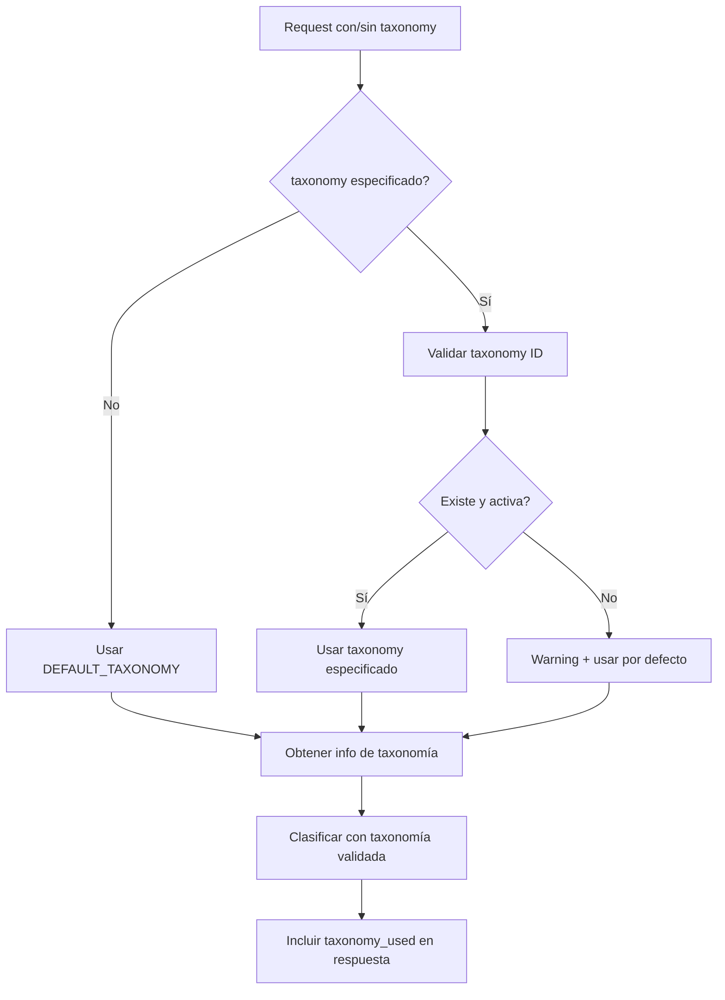

# 🏷️ Feature: Taxonomía Configurable por Parámetro

## 📋 Descripción del Feature

Este feature permite especificar qué taxonomía usar para la clasificación mediante un parámetro opcional `taxonomy`. Si no se especifica, el sistema usa la taxonomía configurada como predeterminada.

## 🎯 Objetivos Cumplidos

✅ **Parámetro opcional**: Agregar `taxonomy` como query parameter opcional  
✅ **Taxonomía por defecto**: Sistema usa taxonomía default si no se especifica  
✅ **Configuración**: Variable de entorno `DEFAULT_TAXONOMY` configurable  
✅ **Validación**: Validar que la taxonomía existe y está activa  
✅ **Información en respuesta**: Incluir qué taxonomía se utilizó

## 🔧 Implementación Técnica

### 1️⃣ **Configuración de Taxonomía por Defecto**

**Variable de entorno (`.env`):**
```properties
DEFAULT_TAXONOMY=treew-skos
```

**Función de configuración (`utils/taxonomy_config.py`):**
- `get_default_taxonomy()`: Obtiene taxonomía desde env o metadata
- `validate_taxonomy_id()`: Valida si taxonomía existe y está activa
- `get_taxonomy_info()`: Obtiene información completa de taxonomía

### 2️⃣ **Endpoints Actualizados**

#### **`POST /classify`** - Clasificación Individual
```bash
# Usar taxonomía por defecto
POST /classify
{"text": "yogur griego", "product_id": "PROD-001"}

# Usar taxonomía específica  
POST /classify?taxonomy=electronics-taxonomy
{"text": "smartphone android", "product_id": "TECH-002"}
```

#### **`POST /classify/products`** - Clasificación Múltiple
```bash
# Usar taxonomía por defecto
POST /classify/products
{"products": [{"text": "aceite oliva", "product_id": "FOOD-001"}]}

# Usar taxonomía específica
POST /classify/products?taxonomy=treew-best
{"products": [{"text": "queso parmesano", "product_id": "DAIRY-002"}]}
```

### 3️⃣ **Modelo de Respuesta Mejorado**

```json
{
  "product_id": "PROD-001",
  "search_text": "yogur griego",
  "concept_uri": "https://treew.io/taxonomy/concept/111206",
  "prefLabel": "Yogur y sustitutos", 
  "notation": "111206",
  "level": 1,
  "confidence": 1.0,
  "timestamp": "2025-09-24T22:50:00Z",
  "taxonomy_used": {
    "id": "treew-skos",
    "name": "TreeW SKOS Food Taxonomy",
    "is_default": true
  }
}
```

## 📚 Casos de Uso

### **1. Sistema con Múltiples Dominios**
```bash
# Productos alimentarios (por defecto)
POST /classify
{"text": "yogur natural"}

# Productos electrónicos  
POST /classify?taxonomy=electronics-taxonomy
{"text": "smartphone 5G"}

# Taxonomía enriquecida
POST /classify?taxonomy=treew-best  
{"text": "aceite de oliva"}
```

### **2. Migración Gradual**
```bash
# Usar taxonomía antigua durante migración
POST /classify?taxonomy=legacy-taxonomy
{"text": "producto legacy"}

# Usar nueva taxonomía mejorada
POST /classify?taxonomy=enhanced-taxonomy
{"text": "mismo producto, nueva clasificación"}
```

### **3. Testing A/B**
```bash
# Comparar resultados entre taxonomías
POST /classify?taxonomy=taxonomy-v1
POST /classify?taxonomy=taxonomy-v2
# Con el mismo producto para evaluar diferencias
```

## 🧪 Validación y Testing

### **Taxonomías Disponibles**
```bash
GET /taxonomies
# Retorna lista de taxonomías activas con sus metadatos
```

### **Información de Taxonomía Actual**
```json
{
  "taxonomy_used": {
    "id": "treew-skos",
    "name": "TreeW SKOS Food Taxonomy", 
    "is_default": true  // true si no se especificó taxonomy parameter
  }
}
```

### **Validación Automática**
- ✅ Si `taxonomy` no existe → usa por defecto
- ✅ Si `taxonomy` está inactiva → usa por defecto  
- ✅ Si `taxonomy=null` → usa por defecto
- ✅ Warning en logs si taxonomía no válida

## 🔄 Flujo de Trabajo



## 🚀 Configuración Recomendada

### **Variables de Entorno**
```properties
# Taxonomía principal del sistema
DEFAULT_TAXONOMY=treew-skos

# URL del servidor MCP
MCP_SERVER_URL=http://localhost:8080

# OpenAI API Key
OPENAI_API_KEY=sk-...
```

### **Metadata de Taxonomías**
```json
{
  "taxonomies": {
    "treew-skos": {
      "is_default": true,
      "is_active": true,
      "name": "TreeW SKOS Food Taxonomy"
    },
    "electronics-taxonomy": {
      "is_default": false, 
      "is_active": true,
      "name": "Electronics Product Taxonomy"
    }
  }
}
```

## ✨ Beneficios del Feature

🎯 **Flexibilidad**: Cambiar taxonomía sin redeployment  
🔄 **Compatibilidad**: Funciona con sistemas existentes  
🧪 **Testing**: Fácil comparación entre taxonomías  
📊 **Trazabilidad**: Saber qué taxonomía se usó  
⚙️ **Configurabilidad**: Variable de entorno simple  

## 📝 Notas de Implementación

- **Retrocompatibilidad**: Endpoints existentes funcionan sin cambios
- **Performance**: Validación de taxonomía es rápida (cache de metadata)
- **Error Handling**: Fallback automático a taxonomía por defecto
- **Logging**: Warnings cuando se usa taxonomía fallback
- **Documentación**: Swagger UI actualizada con ejemplos

---

## 🔗 Enlaces Relacionados

- **Documentación API**: http://localhost:8000/docs
- **Taxonomías disponibles**: `GET /taxonomies`
- **Metadata**: `/taxonomies/metadata.json`