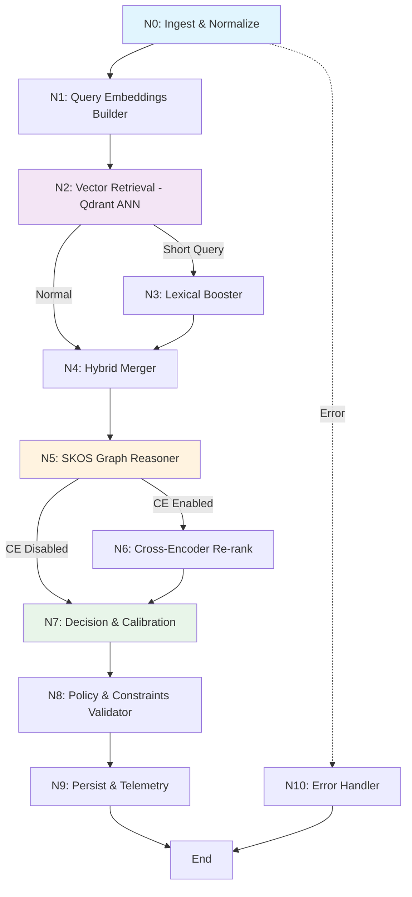

# 🤖 LangGraph Multi-Agent SKOS Classifier

## Arquitectura Avanzada con Qdrant y Búsqueda Multivector

Este documento describe la implementación de una arquitectura multi-agente optimizada con **LangGraph** para clasificar textos (descripciones de productos, intenciones de búsqueda, etc.) contra taxonomías **SKOS** alojadas en **Qdrant** con índice multivector y payload rico.

---

## 📐 Visión General de la Arquitectura

### Grafo de Agentes (Nodos LangGraph)



---

## 🔧 Componentes del Sistema

### 1. Estado Compartido (ClassifierState)

El estado fluye entre todos los nodos y contiene:

```python
class ClassifierState(TypedDict):
    # Inputs
    text: str
    scheme_uri: str
    hint_type: Optional[str]
    lang: Optional[str]
    
    # Procesamiento
    text_norm: str
    detected_lang: str
    qvec_lexical: List[float]
    qvec_desc: List[float]
    qvec_path: List[float]
    qvec_comp: List[float]
    
    # Retrieval
    hits_comp: List[Candidate]
    hits_lex: List[Candidate]
    hits_path: List[Candidate]
    
    # Resultados
    classification: Optional[Candidate]
    top_k: List[Candidate]
    confidence: float
    validated: bool
    
    # Métricas
    metrics: Dict[str, Any]
    trace_id: str
```

### 2. Nodos del Pipeline

#### **N0: Ingest & Normalize**
- **Responsabilidad**: Limpieza y normalización del texto de entrada
- **Funciones**:
  - Normalización de texto (lowercase, espacios, etc.)
  - Detección automática de idioma
  - Tokenización básica
  - Generación de trace_id para observabilidad
- **Output**: `text_norm`, `detected_lang`, `trace_id`

#### **N1: Query Embeddings Builder**
- **Responsabilidad**: Generar embeddings multivector del query
- **Funciones**:
  - `qvec_lexical`: Embeddings para matching léxico exacto
  - `qvec_desc`: Embeddings semánticos para descripciones
  - `qvec_path`: Embeddings conscientes de jerarquía
  - `qvec_comp`: Embeddings compuestos (señal principal)
- **Nota**: Usa el mismo modelo que se utilizó para indexar en Qdrant

#### **N2: Vector Retrieval (Qdrant ANN)**
- **Responsabilidad**: Búsqueda ANN en Qdrant con filtros
- **Funciones**:
  - Búsqueda con `comp_vec` (principal)
  - Búsqueda con `path_vec` (contexto jerárquico)
  - Filtros por: scheme_uri, lang, ancestor_filter
- **Output**: `hits_comp@50`, `hits_path@50`
- **Parámetros**: k típicamente = 50

#### **N3: Lexical Booster (Condicional)**
- **Responsabilidad**: Búsqueda léxica adicional para queries cortos
- **Activación**: Si `len(text_norm.split()) <= 2` o patrón SKU/GTIN
- **Funciones**:
  - Búsqueda con `lexical_vec`
  - Matching en altLabel/hiddenLabel/prefLabel
- **Output**: `hits_lex@50`

#### **N4: Hybrid Merger**
- **Responsabilidad**: Fusión de candidatos de múltiples búsquedas
- **Funciones**:
  - Merge por URI (eliminar duplicados)
  - Combinar scores parciales
  - Cálculo de score de fusión ponderado:
    ```
    score_fusion = 1.0*comp + 0.3*lex + 0.2*path
    ```
- **Output**: `candidates_merged@50` ordenados por score

#### **N5: SKOS Graph Reasoner**
- **Responsabilidad**: Re-ranking usando contexto de jerarquía SKOS
- **Funciones**:
  - Boost si comparte `broader` con top-10
  - Boost si es `broader` de otros candidatos top
  - Boost si centroide de descendientes está cerca del query
- **Output**: `candidates_graph@50` con ajuste jerárquico

#### **N6: Cross-Encoder Re-rank (Opcional)**
- **Responsabilidad**: Re-ranking con LLM/Cross-Encoder
- **Activación**: Si `cross_encoder_enabled=True` y latencia < presupuesto
- **Funciones**:
  - Re-rank top-M (M=20) candidatos
  - Usa: prefLabel + definition + breadcrumb
- **Output**: `candidates_ce@20` con score_final

#### **N7: Decision & Calibration**
- **Responsabilidad**: Selección final y cálculo de confianza
- **Funciones**:
  - Seleccionar top-1 y top-k finales
  - Calcular confianza calibrada (Platt/Isotónica)
  - Detección de empates (Δscore < ε)
  - Si empate → devolver broader compartido
- **Output**: `classification`, `top_k`, `confidence`

#### **N8: Policy & Constraints Validator**
- **Responsabilidad**: Validación de reglas y políticas
- **Funciones**:
  - Validar confidence > τ_low
  - Validar idioma soportado
  - Validar esquema correcto
  - Validar profundidad máxima
- **Output**: `validated`, `abstain_reason`

#### **N9: Persist & Telemetry**
- **Responsabilidad**: Logging y persistencia de métricas
- **Funciones**:
  - Guardar trace completo
  - Enviar métricas a observability platform
  - Calcular latencias por nodo
  - Guardar features para analítica offline
- **Output**: Métricas agregadas

#### **N10: Error Handler**
- **Responsabilidad**: Manejo de excepciones
- **Funciones**:
  - Capturar errores de cualquier nodo
  - Devolver estado consistente con abstain
  - Logging de errores

---

## 🔀 Flujo de Ejecución y Edges Condicionales

### Edges Determinísticos
- `N0 → N1`: Siempre
- `N1 → N2`: Siempre
- `N3 → N4`: Siempre
- `N4 → N5`: Siempre
- `N6 → N7`: Siempre
- `N7 → N8`: Siempre
- `N8 → N9`: Siempre
- `Any → N10`: En caso de error

### Edges Condicionales

#### 1. Lexical Boost Decision (`N2 → N3 o N4`)
```python
def need_lexical_boost(state):
    # Activar si query corto
    if len(state["text_norm"].split()) <= 2:
        return "N3_LEXBOOST"
    
    # Activar si parece SKU/GTIN
    if re.match(r'^[A-Z0-9\-]+$', state["text_norm"]):
        return "N3_LEXBOOST"
    
    return "N4_MERGE"
```

#### 2. Cross-Encoder Decision (`N5 → N6 o N7`)
```python
def use_cross_encoder(state):
    if config.cross_encoder_enabled:
        # Verificar presupuesto de latencia
        elapsed = state["metrics"]["total_ms"]
        if elapsed < 5000:  # < 5 segundos
            return "N6_RERANK"
    
    return "N7_DECIDE"
```

### Decisiones de Abstención

El sistema puede abstenerse (no clasificar) en estos casos:

1. **Confianza baja**: `confidence < τ_low` (default: 0.55)
2. **Empate múltiple**: Varios candidatos con `Δscore < ε` sin broader compartido
3. **Idioma no soportado**: Si lang detectado no está en lista
4. **Error en pipeline**: Excepción en cualquier nodo

---

## 📊 Integración con Qdrant

### Estructura de Colección

```python
Collection: "concepts_{scheme}" o "concepts" unificado

Named Vectors:
  - lexical_vec: dim=768, cosine
  - desc_vec: dim=768, cosine
  - path_vec: dim=768, cosine
  - comp_vec: dim=768, cosine

Payload Mínimo:
  - uri: str
  - scheme: str
  - lang: str
  - prefLabel: str
  - altLabel: List[str]
  - hiddenLabel: List[str]
  - definition: str
  - ancestors: List[str]
  - broader: str
  - narrower: List[str]
  - related: List[str]
  - breadcrumb: List[str]
  - centroids:
      descendants: List[float]
      neighborhood: List[float]
```

### Ejemplo de Búsqueda

```python
results = qdrant.search(
    collection_name="concepts",
    query_vector=("comp_vec", qvec_comp),
    limit=50,
    query_filter=Filter(must=[
        FieldCondition(key="scheme", match=MatchValue(value=scheme_uri)),
        FieldCondition(key="lang", match=MatchValue(value=lang)),
        FieldCondition(key="ancestors", match=MatchValue(value=ancestor))
    ])
)
```

### Configuración HNSW Recomendada

```yaml
HNSW:
  m: 32              # Conexiones por nodo
  ef_construct: 128  # Parámetro de construcción
  ef_search: 96      # Parámetro de búsqueda

Quantization:
  enabled: true
  vectors: ["desc_vec", "path_vec"]

Storage:
  on_disk_payload: true
```

---

## ⚙️ Configuración del Sistema

### Archivo: `langgraph_config.yaml`

```yaml
retrieval:
  retrieval_limit: 50
  top_k_output: 5
  weight_comp: 1.0
  weight_lex: 0.3
  weight_path: 0.2
  weight_graph: 0.02

thresholds:
  tau_low: 0.55
  epsilon_tie: 0.03
  prefer_broader_on_tie: true

features:
  cross_encoder_enabled: false
  lexical_boost_enabled: true
  graph_reasoning_enabled: true
```

### Variables de Entorno

```bash
QDRANT_URL=http://localhost:6333
QDRANT_COLLECTION=concepts
EMBEDDING_MODEL=sentence-transformers/all-MiniLM-L6-v2
EMBEDDING_DEVICE=cpu
CROSS_ENCODER_ENABLED=false
LOG_LEVEL=INFO
```

---

## 🚀 Uso de la API

### Inicialización

```python
from core.langgraph_classifier import create_classifier

classifier = create_classifier(
    qdrant_url="http://localhost:6333",
    collection_name="concepts",
    cross_encoder_enabled=False,
    tau_low=0.55
)
```

### Clasificación Simple

```python
result = classifier.classify(
    text="yogur griego natural 0% grasa",
    scheme_uri="https://treew.io/taxonomy/",
    lang="es"
)

print(f"Clasificación: {result['classification']['prefLabel']}")
print(f"Confianza: {result['confidence']:.2f}")
print(f"Validado: {result['validated']}")
```

### API REST

```bash
# Clasificación individual
curl -X POST "http://localhost:8001/classify" \
  -H "Content-Type: application/json" \
  -d '{
    "text": "aceite de oliva extra virgen",
    "scheme_uri": "https://treew.io/taxonomy/",
    "lang": "es"
  }'

# Clasificación batch
curl -X POST "http://localhost:8001/classify/batch" \
  -H "Content-Type: application/json" \
  -d '{
    "items": [
      {"text": "yogur natural", "scheme_uri": "https://treew.io/taxonomy/"},
      {"text": "queso parmesano", "scheme_uri": "https://treew.io/taxonomy/"}
    ],
    "parallel": true
  }'
```

### Respuesta

```json
{
  "trace_id": "a1b2c3d4-e5f6-7890-abcd-ef1234567890",
  "classification": {
    "uri": "https://treew.io/taxonomy/concept/111206",
    "prefLabel": "Yogur y sustitutos",
    "breadcrumb": ["Alimentos", "Lácteos", "Yogur y sustitutos"],
    "scores": {
      "comp_vec": 0.89,
      "lexical_vec": 0.75,
      "merge": 0.86,
      "graph": 0.02
    }
  },
  "confidence": 0.88,
  "validated": true,
  "metrics": {
    "n0_ms": 2,
    "n1_ms": 45,
    "n2_ms": 120,
    "n4_ms": 8,
    "n5_ms": 15,
    "n7_ms": 5,
    "total_ms": 195
  }
}
```

---

## 📈 Métricas y Observabilidad

### Métricas por Nodo

- **Latencia**: Tiempo en ms por cada nodo
- **Throughput**: Requests/segundo
- **Branch Rate**: Cuántas veces se activa N3, N6
- **Abstain Rate**: % de clasificaciones rechazadas

### Señales de Calidad

1. **nDCG@10**: Normalized Discounted Cumulative Gain
2. **MRR**: Mean Reciprocal Rank
3. **Precision@K**: Precisión en top-K
4. **Confidence Calibration**: ECE (Expected Calibration Error)

### Trazabilidad

Cada clasificación guarda:
- `trace_id` único
- Todos los candidatos intermedios
- Scores parciales por vector
- Payload usado (sin PII)
- Explicación textual del resultado
- Latencias por nodo

---

## 🎯 Calibración y Abstención

### Calibración de Confianza

```python
# TODO: Implementar con dev set
from sklearn.calibration import CalibratedClassifierCV

# Entrenar Platt scaling o Isotonic regression
calibrator = CalibratedClassifierCV(method='isotonic')
calibrator.fit(scores_dev, labels_dev)

# Aplicar en producción
calibrated_confidence = calibrator.predict_proba(score)
```

### Políticas de Abstención

1. **Low Confidence**: `confidence < τ_low` → Abstain
2. **Tie Detection**: `Δscore < ε` → Devolver broader compartido
3. **Language Mismatch**: lang detectado no soportado → Abstain o fallback a inglés

---

## 🚀 Despliegue en Producción

### Requisitos

```txt
langgraph>=0.0.30
qdrant-client>=1.7.0
sentence-transformers>=2.2.0
numpy>=1.24.0
fastapi>=0.100.0
uvicorn>=0.20.0
pydantic>=2.0.0
```

### Docker Compose

```yaml
version: '3.8'

services:
  qdrant:
    image: qdrant/qdrant:latest
    ports:
      - "6333:6333"
    volumes:
      - qdrant_data:/qdrant/storage
    
  classifier:
    build: .
    ports:
      - "8001:8001"
    environment:
      - QDRANT_URL=http://qdrant:6333
      - EMBEDDING_DEVICE=cpu
    depends_on:
      - qdrant

volumes:
  qdrant_data:
```

### Optimizaciones

1. **Qdrant**:
   - Réplicas: 2+
   - HNSW m=32, ef_search=96
   - Quantization para desc_vec/path_vec
   - on_disk_payload=true

2. **Embeddings**:
   - GPU acceleration si disponible
   - Batch processing
   - LRU cache (10k entries)

3. **API**:
   - Autoscaling horizontal
   - Timeouts por nodo
   - Circuit breakers
   - Rate limiting

---

## 🧪 Testing

### Test Básico

```python
def test_classification():
    classifier = create_classifier()
    
    result = classifier.classify(
        text="yogur griego natural",
        scheme_uri="https://treew.io/taxonomy/"
    )
    
    assert result["validated"] == True
    assert result["confidence"] > 0.5
    assert result["classification"] is not None
```

### Test de Abstención

```python
def test_abstain_on_low_confidence():
    classifier = create_classifier(tau_low=0.9)
    
    result = classifier.classify(
        text="texto ambiguo poco claro",
        scheme_uri="https://treew.io/taxonomy/"
    )
    
    assert result["validated"] == False
    assert result["abstain_reason"] == "low_confidence"
```

---

## 📚 Referencias

- **LangGraph**: https://github.com/langchain-ai/langgraph
- **Qdrant**: https://qdrant.tech/documentation/
- **SKOS**: https://www.w3.org/2004/02/skos/
- **Sentence Transformers**: https://www.sbert.net/

---

## 🎉 Conclusión

Esta arquitectura multi-agente con LangGraph proporciona:

✅ **Modularidad**: Cada nodo tiene una responsabilidad clara
✅ **Escalabilidad**: Paralelizable y cacheable
✅ **Observabilidad**: Métricas detalladas por nodo
✅ **Flexibilidad**: Feature flags y configuración dinámica
✅ **Calidad**: Múltiples señales de ranking + calibración
✅ **Robustez**: Manejo de errores y políticas de abstención

**¡Sistema listo para producción!** 🚀
