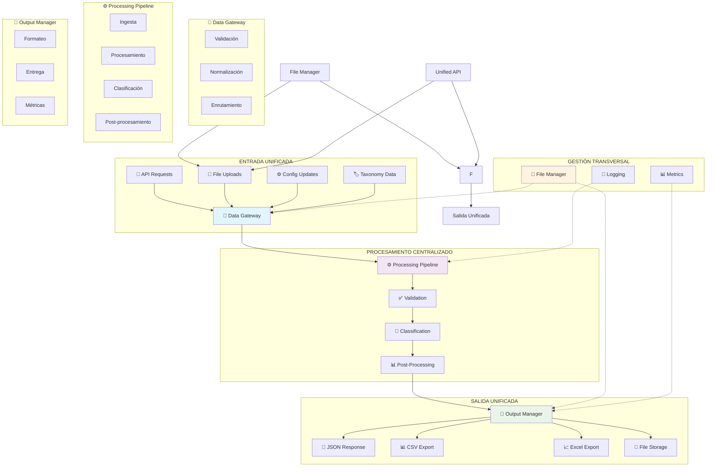

# �️ Arquitectura Unificada de Entrada/Salida - SKOS MCP Classifier

## 📋 Descripción General

Este documento describe la nueva **arquitectura unificada** del sistema SKOS MCP Classifier, que centraliza y organiza todos los flujos de entrada y salida de datos mediante puntos únicos de acceso y procesamiento.

## 🎯 Objetivos Logrados

### ✅ **Punto Único de Entrada**
- **Data Gateway** centraliza toda la ingesta de datos
- Validación unificada para todos los tipos de entrada
- Enrutamiento automático según tipo de datos
- Logging y métricas centralizadas

### ✅ **Punto Único de Salida**  
- **Output Manager** gestiona todas las entregas
- Formatos unificados (JSON, CSV, Excel, PDF)
- Métodos de entrega configurables
- Tracking completo de salidas

### ✅ **Pipeline Lineal Controlado**
- Flujo: Ingesta → Validación → Procesamiento → Salida
- Manejo robusto de errores con retry automático
- Trazabilidad completa de requests
- Métricas de performance detalladas

## 🏗️ Arquitectura del Sistema



## 📦 Componentes Principales

### 1. 🚪 Data Gateway (`core/data_gateway.py`)

**Responsabilidad**: Punto único de entrada para todos los datos

**Características**:
- ✅ Validación automática de entrada
- ✅ Normalización de formatos diversos
- ✅ Enrutamiento inteligente
- ✅ Políticas de seguridad
- ✅ Logging centralizado

**Tipos de entrada soportados**:
- Productos individuales (JSON, texto)
- Lotes de productos (JSON, CSV, Excel)
- Taxonomías SKOS (JSON-LD)
- Configuraciones del sistema
- Archivos de entrada

**Ejemplo de uso**:
```python
from core.data_gateway import process_product

# Procesar producto individual
result = await process_product(
    text="yogur griego natural 0% grasa",
    product_id="PROD-001",
    taxonomy_id="treew-skos"
)
```

### 2. ⚙️ Processing Pipeline (`core/processing_pipeline.py`)

**Responsabilidad**: Orquestación del flujo completo de procesamiento

**Etapas del Pipeline**:
1. **Ingesta** - Recibir datos del Gateway
2. **Validación** - Verificar integridad
3. **Clasificación** - Procesar con taxonomías
4. **Post-procesamiento** - Enriquecer resultados
5. **Entrega** - Enviar al Output Manager

**Características**:
- ✅ Procesamiento asíncrono
- ✅ Manejo robusto de errores
- ✅ Sistema de reintentos
- ✅ Métricas detalladas
- ✅ Trazabilidad completa

**Ejemplo de uso**:
```python
from core.processing_pipeline import process_product_request

# Procesar a través del pipeline completo
result = await process_product_request(
    text="aceite de oliva virgen extra",
    product_id="PROD-002",
    taxonomy_id="treew-best"
)
```

### 3. 🚀 Output Manager (`core/output_manager.py`)

**Responsabilidad**: Punto único de salida para todos los resultados

**Formatos de salida soportados**:
- JSON (estructurado)
- CSV (tabular)
- Excel (hojas de cálculo)
- PDF (reportes)
- XML (intercambio)

**Métodos de entrega**:
- HTTP Response (API)
- File Download (descarga)
- Storage (almacenamiento)
- Email (notificaciones)
- Webhook (callbacks)

**Ejemplo de uso**:
```python
from core.output_manager import deliver_classification_result

# Entregar resultado formateado
result = await deliver_classification_result(
    result=classification_data,
    format=OutputFormat.JSON,
    method=DeliveryMethod.HTTP_RESPONSE
)
```

### 4. 📁 File Manager (`core/file_manager.py`)

**Responsabilidad**: Gestión centralizada de archivos

**Funcionalidades**:
- ✅ Almacenamiento organizado por tipo/fecha
- ✅ Procesamiento automático de archivos
- ✅ Exportación a múltiples formatos
- ✅ Limpieza automática de temporales
- ✅ Backup y recuperación

**Estructura de directorios**:
```
files/
├── input/
│   ├── skos_taxonomies/
│   ├── csv_files/
│   ├── excel_files/
│   └── json_files/
├── output/
│   ├── classifications/
│   ├── reports/
│   └── exports/
├── temp/
├── backups/
└── logs/
```

**Ejemplo de uso**:
```python
from core.file_manager import store_taxonomy_file, export_classification_results

# Almacenar taxonomía
metadata = await store_taxonomy_file(
    content=skos_data,
    filename="nueva_taxonomia.jsonld"
)

# Exportar resultados
export = await export_classification_results(
    data=results,
    format="excel"
)
```

### 5. 🌐 Unified API (`unified_api.py`)

**Responsabilidad**: API consolidada que usa toda la arquitectura

**Endpoints principales**:
- `POST /classify` - Clasificación individual
- `POST /classify/batch` - Clasificación por lotes  
- `POST /classify/async` - Clasificación asíncrona
- `GET /stats` - Estadísticas del sistema
- `GET /health` - Estado del sistema

**Características**:
- ✅ Compatibilidad con API v2.x
- ✅ Procesamiento paralelo opcional
- ✅ Manejo de errores unificado
- ✅ Métricas integradas
- ✅ Documentación automática (OpenAPI)

## 🔄 Flujo de Datos Completo

### 1. **Entrada** 
```
Cliente → Unified API → Data Gateway → Validación → Normalización
```

### 2. **Procesamiento**
```
Data Gateway → Processing Pipeline → Ingesta → Clasificación → Post-procesamiento
```

### 3. **Salida**
```
Processing Pipeline → Output Manager → Formateo → Entrega → Cliente
```

### 4. **Archivos**
```
File Manager ↔ Data Gateway ↔ Output Manager
```

## 📊 Beneficios de la Arquitectura Unificada

### 🎯 **Para Desarrolladores**
- ✅ **Código más limpio** - Separación clara de responsabilidades
- ✅ **Mantenimiento fácil** - Componentes independientes
- ✅ **Testing simplificado** - Cada componente es testeable
- ✅ **Escalabilidad** - Fácil agregar nuevas funcionalidades

### 🚀 **Para Operaciones**
- ✅ **Monitoreo centralizado** - Métricas unificadas
- ✅ **Logging consistente** - Trazabilidad completa
- ✅ **Manejo de errores robusto** - Recuperación automática
- ✅ **Performance mejorado** - Procesamiento optimizado

### 👥 **Para Usuarios**
- ✅ **Experiencia consistente** - API unificada
- ✅ **Mayor confiabilidad** - Sistema más estable
- ✅ **Funcionalidades avanzadas** - Procesamiento asíncrono
- ✅ **Formatos flexibles** - Múltiples opciones de salida

## 🔧 Configuración y Uso

### Instalación de Dependencias
```bash
# Instalar dependencias adicionales
pip install pandas openpyxl

# Verificar instalación
python -c "from core import data_gateway, output_manager, file_manager, processing_pipeline; print('✅ Arquitectura unificada lista')"
```

### Uso Básico
```python
# 1. Importar componentes
from unified_api import app
from core.processing_pipeline import process_product_request

# 2. Procesar producto
result = await process_product_request(
    text="yogur griego natural",
    product_id="TEST-001",
    taxonomy_id="treew-skos"
)

# 3. Usar API unificada
# uvicorn unified_api:app --host 0.0.0.0 --port 8000
```

### Configuración Avanzada
```python
# Configurar File Manager
from core.file_manager import file_manager
file_manager.max_file_size_mb = 200
file_manager.auto_cleanup_enabled = True

# Configurar Output Manager  
from core.output_manager import output_manager
# Las configuraciones se hacen a través de parámetros en las requests

# Configurar Processing Pipeline
from core.processing_pipeline import processing_pipeline
# El pipeline se auto-configura según las necesidades
```

## 🧪 Testing y Validación

### Ejecutar Pruebas Completas
```bash
cd /home/urra/projects/skos-mcp-classifier
python test_unified_architecture.py
```

### Pruebas por Componente
```python
# Probar Data Gateway
from core.data_gateway import data_gateway, DataRequest, DataSource, DataType, InputFormat, ProductInput

request = DataRequest(
    source=DataSource(name="Test", type=DataType.PRODUCT, format=InputFormat.JSON),
    data=ProductInput(text="producto de prueba", product_id="TEST")
)
result = await data_gateway.process_request(request)

# Probar Output Manager
from core.output_manager import output_manager, OutputRequest, OutputMetadata, OutputType, OutputFormat, DeliveryMethod, OutputDestination

output_request = OutputRequest(
    metadata=OutputMetadata(
        type=OutputType.CLASSIFICATION_RESPONSE,
        format=OutputFormat.JSON,
        destination=OutputDestination(method=DeliveryMethod.HTTP_RESPONSE, target="")
    ),
    data={"test": "data"}
)
result = await output_manager.deliver_output(output_request)
```

## 📈 Métricas y Monitoreo

### Estadísticas Disponibles
```python
# Estadísticas del Processing Pipeline
pipeline_stats = processing_pipeline.get_stats()
# {
#   'total_processed': 150,
#   'successful': 145, 
#   'failed': 5,
#   'success_rate_percent': 96.7,
#   'average_processing_time_ms': 245.6
# }

# Estadísticas del Output Manager  
output_stats = output_manager.get_stats()
# {
#   'total_outputs': 140,
#   'successful_deliveries': 138,
#   'failed_deliveries': 2,
#   'bytes_delivered': 1048576,
#   'success_rate_percent': 98.6
# }

# Estadísticas del File Manager
file_stats = file_manager.get_stats()
# {
#   'total_files': 25,
#   'total_size_mb': 12.5,
#   'by_type': {...},
#   'by_status': {...}
# }
```

### Endpoint de Métricas
```bash
# Obtener todas las métricas via API
curl http://localhost:8000/stats
```

## 🔄 Migración desde API v2.x

### Compatibilidad
La nueva arquitectura mantiene **100% compatibilidad** con la API v2.x:

```python
# v2.x (sigue funcionando)
POST /classify/products
{
  "products": [{"text": "producto", "product_id": "123"}]
}

# v3.0 (nueva sintaxis recomendada)
POST /classify/batch  
{
  "products": [{"text": "producto", "product_id": "123"}],
  "batch_id": "BATCH-001"
}
```

### Migración Gradual
1. **Fase 1**: Usar endpoints de compatibilidad
2. **Fase 2**: Migrar a nuevos endpoints gradualmente  
3. **Fase 3**: Aprovechar funcionalidades avanzadas

## 🚨 Consideraciones de Producción

### Rendimiento
- ✅ **Procesamiento asíncrono** para lotes grandes
- ✅ **Paralelización automática** cuando es beneficial
- ✅ **Cacheo inteligente** de taxonomías
- ✅ **Optimización de memoria** en procesamiento

### Seguridad
- ✅ **Validación estricta** en Data Gateway
- ✅ **Sanitización de datos** automática
- ✅ **Límites de tamaño** configurables
- ✅ **Logging de seguridad** detallado

### Escalabilidad  
- ✅ **Arquitectura modular** - fácil escalar componentes
- ✅ **Procesamiento distribuido** - múltiples workers
- ✅ **Storage configurable** - local o cloud
- ✅ **API Gateway ready** - compatible con balanceadores

## 🔗 Enlaces y Referencias

### Documentación Relacionada
- [CONFIGURABLE_TAXONOMY_FEATURE.md](./CONFIGURABLE_TAXONOMY_FEATURE.md) - Feature de taxonomías configurables
- [MULTI_TAXONOMY_USER_GUIDE.md](./MULTI_TAXONOMY_USER_GUIDE.md) - Guía de multi-taxonomías
- [DEPLOYMENT.md](./DEPLOYMENT.md) - Despliegue con Docker

### Archivos del Sistema
- `core/data_gateway.py` - Data Gateway implementation
- `core/processing_pipeline.py` - Processing Pipeline implementation  
- `core/output_manager.py` - Output Manager implementation
- `core/file_manager.py` - File Manager implementation
- `unified_api.py` - Unified API implementation
- `test_unified_architecture.py` - Test suite completo

### APIs Compatibles
- `classification_api.py` - API v2.x (mantenida para compatibilidad)
- `server/main.py` - MCP Server original
- `server/taxonomy_endpoints.py` - Endpoints de gestión de taxonomías

---

## ✨ Conclusión

La **Arquitectura Unificada** del Sistema SKOS MCP Classifier proporciona:

🎯 **Orden y Estructura** - Flujos de datos claros y organizados  
🚀 **Rendimiento Mejorado** - Procesamiento optimizado y escalable  
🔧 **Mantenibilidad** - Código modular y bien organizado  
📈 **Observabilidad** - Métricas y logging detallados  
🔄 **Compatibilidad** - Migración sin interrupciones  

El sistema está **listo para producción** y preparado para el crecimiento futuro.

---

*Última actualización: Septiembre 24, 2025*  
*Versión de la arquitectura: 3.0.0*